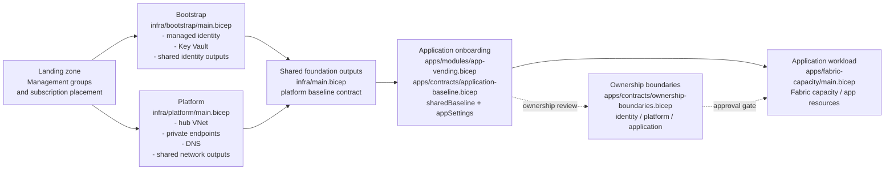

# Implementation Plan: Multi-Application Baseline Consumption

**Branch**: `002-multi-app-baseline-consumption` | **Date**: 2026-09-01 | **Spec**: [specs/002-multi-app-baseline-consumption/spec.md](./spec.md)

**Input**: Feature specification from `/specs/002-multi-app-baseline-consumption/spec.md`

## Summary

Define a reusable application baseline contract that lets multiple application
deployments consume the shared bootstrap and platform foundation without
redefining it per workload. The design keeps subscription-scope onboarding and
resource-group-scope workloads as complementary patterns, preserves identity,
platform, and application ownership boundaries, and prepares the repo for
separate deployment stacks where lifecycle or access control differs.

## Architecture View



The shared foundation owns the platform and bootstrap facts. The application
layer consumes that approved baseline instead of re-defining the platform and
identity assumptions for each workload.

## Technical Context

**Language/Version**: Bicep templates, Bicep parameter files, ARM deployment
model, Markdown design artifacts

**Primary Dependencies**: Azure Resource Manager deployments, Azure CLI,
Azure Verified Modules, current repo Bicep module structure under `infra/` and
`apps/`

**Storage**: N/A for runtime application data; repository-hosted IaC, parameter,
and documentation files only

**Testing**: Bicep diagnostics, focused template builds, `az deployment ...
what-if`, targeted non-production `create` deployments, post-deploy Azure
resource inspection

**Target Platform**: Azure tenant, management group, subscription, and resource
group scopes managed from the repo devcontainer on Linux

**Project Type**: Infrastructure-as-code landing-zone baseline with application
onboarding patterns

**Performance Goals**: Reviewers can determine ownership boundaries, placement,
and shared-service dependencies for an onboarding definition in under 10 minutes
for most reviews

**Constraints**: Preserve landing-zone -> subscription -> bootstrap -> platform
layering; keep shared foundation reusable; maintain safe re-run behavior; avoid
embedding identity- or platform-owned concerns into application-owned
deployments; prepare for separate deployment stacks where ownership differs;
support least-privilege RBAC modeling with explicit ownership-domain security
principals and scoped role assignments where principal IDs are supplied; keep
the onboarding model reusable across provider-hosted PoCs and client-tenant
deployments without forking the delivery process

**Scale/Scope**: Multiple applications across shared or dedicated subscriptions,
each with one or more environments, all consuming a common enterprise baseline
and supporting both provider-owned demonstration environments and client-owned
delivery environments

## Constitution Check

*GATE: Must pass before Phase 0 research. Re-check after Phase 1 design.*

- **Layered Landing-Zone Architecture**: PASS. The plan extends the application
  onboarding layer without bypassing tenant, subscription, bootstrap, or
  platform layers.
- **Idempotent Desired-State Deployments**: PASS. The design keeps shared
  foundation and per-application deployment units separately re-runnable.
- **AVM-First Modular Composition**: PASS. The plan retains AVM-first guidance
  for future shared and application resource additions.
- **Secure-by-Default Platform Boundaries and Ownership Isolation**: PASS. The
  plan explicitly separates identity, platform, and application ownership and
  preserves deployment-boundary isolation.
- **Validate Before Merge and Deploy**: PASS. The plan uses what-if, focused
  deployment checks, and contract review as primary validation mechanisms.

**Post-Design Re-check**: PASS. Research, contracts, and quickstart preserve the
same gates and do not introduce constitution violations.

## Project Structure

### Documentation (this feature)

```text
specs/002-multi-app-baseline-consumption/
├── plan.md
├── research.md
├── data-model.md
├── quickstart.md
├── contracts/
│   ├── application-baseline-contract.md
│   └── ownership-boundary-contract.md
└── tasks.md
```

### Source Code (repository root)

```text
infra/
├── main.bicep
├── dev.bicepparam
├── landingzone/
│   └── main.bicep
├── bootstrap/
│   └── main.bicep
└── platform/
    └── main.bicep

apps/
└── fabric-capacity/
    ├── main.bicep
    └── vend.bicep

deploy/
└── main.bicep

.specify/
└── memory/constitution.md

specs/
├── 001-standardize-app-onboarding/
└── 002-multi-app-baseline-consumption/
```

**Structure Decision**: Keep shared foundation composition in `infra/` and keep
per-application deployment units under `apps/`. The feature will define a new
application baseline contract and future onboarding pattern that can introduce a
shared application onboarding layer without collapsing shared platform concerns
into individual application templates.

**Security Decision**: Treat Entra group definitions, minimum roles, and scoped
Azure role assignments as part of the onboarding contract. Where the repo can
legally and safely create role assignments at subscription or resource-group
scope, implementation should accept principal IDs as inputs and create the
required assignments declaratively in Bicep. Tenant-level group lifecycle may
remain external, but the contract and deployment surfaces must not leave RBAC
requirements implicit.

**Engagement Model Decision**: Treat provider-hosted PoCs, internal learning
deployments, and client-tenant deployments as different engagement modes of the
same onboarding contract. The contract should allow provider-owned defaults for
fast demos, but it must also identify which fields become mandatory client
inputs, approvals, or access prerequisites when the deployment target moves to a
client-owned tenant.

## Complexity Tracking

No constitution violations currently require justification.

## T043 lifecycle validation evidence

### Preflight — 2026-09-21

Status: **Incomplete; no Azure deployment or cleanup executed.**

- The feature requirements checklist has 16 checked items and no unchecked items.
- `az bicep build --file apps/recipe-template/infra/main.bicep --stdout`
  succeeds. Bicep reports the repository's enabled experimental Asserts feature.
- The checked-in recipe is a scaffold, not a complete application: its
  `azure.yaml` declares an App Service project at `./src`, but that directory
  is absent. Its Bicep template creates only a resource group; shared baseline
  and ownership inputs are returned as metadata, without a deployed workload.
- `azd show --cwd apps/recipe-template --no-prompt` reports no environments.
- Azure CLI and Azure Developer CLI are installed (`azd` 1.34.1). On the
  subsequent authentication check, Azure CLI successfully acquired a token
  for the enabled `Microsoft Partner Network` subscription. Azure Developer
  CLI still reports that authentication is required.

Required next inputs: the external application recipe path or repository URL,
confirmation of the non-production target, an authenticated azd session, and
published shared-baseline values for that environment.

### Evidence required to complete T043

1. Record the recipe revision, tenant, subscription, region, dedicated test
   environment, and application resource group. Confirm the application group
   does not already contain unrelated resources.
2. Inspect the recipe's templates and hooks, then review its what-if. Confirm
   all planned changes belong to the application and shared resources are
   references only.
3. Capture the shared baseline resource inventory and relevant configuration
   before deployment. Record any pre-existing resource groups associated with
   the chosen azd environment so cleanup cannot select an unrelated group.
4. Run `azd up` from the external recipe and retain its result, deployment
   operations, and application resource inventory. Confirm the deployed
   workload succeeds and shared foundation resources remain unchanged.
5. Review the cleanup scope, run `azd down` for the same environment, and
   retain its result. Verify the application resources are removed and compare
   the shared baseline inventory and configuration with the pre-run evidence.
6. Record results here, including failures or residual resources. Mark T043
   complete only after the live deployment and cleanup checks pass.

An empty-resource-group deployment or a successful local build alone does not
satisfy the application lifecycle validation.
